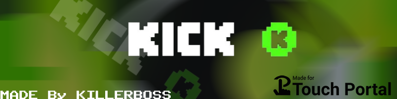

# Kick-Streaming

- [Kick-Streaming](#Kick-Streaming)
  - [Description](#description) 
  - [Settings Overview](#Settings-Overview)
  - [Features](#Features)
    - [Actions](#actions)
        - [Kick - Chat](#com.github.killerboss2019.kicktp.chatactions)
    - [States](#states)
        - [Kick - Profile](#com.github.killerboss2019.kicktp.mainstates)
        - [Kick - Chat](#com.github.killerboss2019.kicktp.chatstates)
        - [Kick - Poll](#com.github.killerboss2019.kicktp.pollstates)
        - [Kick - Socials](#com.github.killerboss2019.kicktp.socialsstates)
        - [Kick - Stream Info](#com.github.killerboss2019.kicktp.streaminfostates)
        - [Kick - Raid](#com.github.killerboss2019.kicktp.raidstates)
    - [Events](#events)
        - [Kick - Chat](#com.github.killerboss2019.kicktp.chatevents)
  - [Bugs and Support](#bugs-and-suggestion)
  - [License](#license)
  
# Description
Kick integration for TouchPortal. It will allow you to control your stream and chat from TouchPortal. It will also allow you to display information about your stream and chat in TouchPortal.

# Initial Setup
1. Download and install the plugin from [here](https://github.com/KillerBOSS2019/Kick-Streaming-TouchPortal/releases)
2. Open TouchPortal and go to plugin settings. in the plugin settings, you will need to enter your Kick email and password. This is required to login to Kick and get the required information.

## Settings Overview
| Read-only | Type | Default Value |
| --- | --- | --- |
| False | text |  |

Email used to login to kick

| Read-only | Type | Default Value |
| --- | --- | --- |
| False | text |  |

Password used to login to kick

| Read-only | Type | Default Value |
| --- | --- | --- |
| False | text | 5 |

Number of states will be created to show chat history. eg 5 will show 5 latest messages

| Read-only | Type | Default Value |
| --- | --- | --- |
| False | text | DEBUG |

Debugging level. eg DEBUG, INFO, WARNING, ERROR, CRITICAL

| Read-only | Type | Default Value |
| --- | --- | --- |
| False | text | %I:%M:%S %p |

Time format for chat message. help with formatting can be found here https://strftime.org/

# Features

## Actions

<b>Category:</b> Kick - Chat <small><ins>(Click to expand)</ins></small>
<table>
<tr valign='buttom'><th>Action Name</th><th>Description</th><th>Format</th><th nowrap>Data 
choices/default (in bold)</th><th>On Hold
</th></tr>
<tr valign='top'><td>Send Chat Message</td><td>Send message to chat</td><td>Send [1]</td><td><ol start=1><li>Type: text &nbsp; 
Default: <b>Hello World!</b></li>
</ol></td>
<td align=center>No</td>
<tr valign='top'><td>Clear Chat</td><td>Clear chat</td><td>Clear Chat</td><td> </td>
<td align=center>No</td>
<tr valign='top'><td>Add or Remove Moderator</td><td>Add or remove moderator</td><td>[1][2] as moderator</td><td><ol start=1><li>Type: choice &nbsp; 
Default: <b>Add</b> Possible choices: ['Add', 'Remove']</li>
<li>Type: text &nbsp; 
&lt;empty&gt;</li>
</ol></td>
<td align=center>No</td>
<tr valign='top'><td>Follow or Unfollow User</td><td>Follow or unfollow user</td><td>[1][2]</td><td><ol start=1><li>Type: choice &nbsp; 
Default: <b>Follow</b> Possible choices: ['Follow', 'Unfollow']</li>
<li>Type: text &nbsp; 
&lt;empty&gt;</li>
</ol></td>
<td align=center>No</td>
<tr valign='top'><td>Create Poll</td><td>Create poll. requires at least 2 options</td><td>Create Poll: [9] duration: [2] result displayed for [1] with [8] [7] [6] [5] [4] [3]</td><td>

<ins>Click to expand</ins>
<ol start=1>
<li>Type: choice &nbsp; 
Default: <b>15 seconds</b> Possible choices: ['15 seconds', '30 seconds', '2 minutes', '3 minutes', '4 minutes', '5 minutes']</li>
<li>Type: choice &nbsp; 
Default: <b>30</b> Possible choices: ['30 seconds', '2 minutes', '3 minutes', '4 minutes', '5 minutes']</li>
<li>Type: text &nbsp; 
&lt;empty&gt;</li>
<li>Type: text &nbsp; 
&lt;empty&gt;</li>
<li>Type: text &nbsp; 
&lt;empty&gt;</li>
<li>Type: text &nbsp; 
&lt;empty&gt;</li>
<li>Type: text &nbsp; 
&lt;empty&gt;</li>
<li>Type: text &nbsp; 
&lt;empty&gt;</li>
<li>Type: text &nbsp; 
&lt;empty&gt;</li>
</ol></td>

<td align=center>No</td>
<tr valign='top'><td>Vote Poll</td><td>Vote poll 1-6 depending on the number of options in the poll</td><td>Vote Poll: [1]</td><td><ol start=1><li>Type: choice &nbsp; 
Default: <b>Option 1</b> Possible choices: ['Option 1', 'Option 2', 'Option 3', 'Option 4', 'Option 5', 'Option 6']</li>
</ol></td>
<td align=center>No</td>
<tr valign='top'><td>End Poll</td><td>Delete / Cancel current active poll</td><td>End Poll</td><td> </td>
<td align=center>No</td>
<tr valign='top'><td>Temporary Ban User</td><td>Temporary ban specific user with reason and duration in minutes</td><td>Temporary Ban: [3] for [2]minutes with reason: [1]</td><td><ol start=1><li>Type: text &nbsp; 
&lt;empty&gt;</li>
<li>Type: text &nbsp; 
Default: <b>1</b></li>
<li>Type: text &nbsp; 
&lt;empty&gt;</li>
</ol></td>
<td align=center>No</td>
<tr valign='top'><td>Ban</td><td>Permanently ban specific user</td><td>Ban: [2] with reason: [1]</td><td><ol start=1><li>Type: text &nbsp; 
&lt;empty&gt;</li>
<li>Type: text &nbsp; 
&lt;empty&gt;</li>
</ol></td>
<td align=center>No</td>
<tr valign='top'><td>Unban</td><td>Unban specific user</td><td>Unban: [1]</td><td><ol start=1><li>Type: text &nbsp; 
&lt;empty&gt;</li>
</ol></td>
<td align=center>No</td>
</tr></table>

 

## States

<b>Category:</b> Kick - Profile <small><ins>(Click to expand)</ins></small>

| Id | Description | DefaultValue | parentGroup |
| --- | --- | --- | --- |
| .state.profile_image | Kick Profile Image | None | Kick profile |
| .state.profile_name | Kick Profile Name | None | Kick profile |
| .state.profile_follower_count | Kick Profile Follower Count | 0 | Kick profile |
| .state.profile_bio | Kick Profile Bio | None | Kick profile |
| .state.country | Kick Profile Country | None | Kick profile |
| .state.state | Kick Profile State | None | Kick profile |
| .state.city | Kick Profile City | None | Kick profile |

<b>Category:</b> Kick - Socials <small><ins>(Click to expand)</ins></small>

| Id | Description | DefaultValue | parentGroup |
| --- | --- | --- | --- |
| .state.instagram | Kick Profile Instagram | None | Kick - Socials |
| .state.twitter | Kick Profile Twitter | None | Kick - Socials |
| .state.youtube | Kick Profile Youtube | None | Kick - Socials |
| .state.discord | Kick Profile Discord | None | Kick - Socials |
| .state.tiktik | Kick Profile TikTok | None | Kick - Socials |
| .state.facebook | Kick Profile Facebook | None | Kick - Socials |

<b>Category:</b> Kick - Stream Info <small><ins>(Click to expand)</ins></small>

| Id | Description | DefaultValue | parentGroup |
| --- | --- | --- | --- |
| .state.streaming_status | Kick is Live | False | Kick stream info |
| .state.streaming_title | Kick Stream Title | None | Kick stream info |
| .state.streaming_viewers | Kick stream viewer count | 0 | Kick stream info |
| .state.streaming_duration | Kick Stream Duration | 0 | Kick stream info |
| .state.is_mature | Kick Stream is Mature | False | Kick stream info |
| .state.stream_lang | Kick Stream Language | None | Kick stream info |
| .state.stream_thumbnail | Kick Stream Thumbnail | None | Kick stream info |
| .state.stream_topic | Kick Stream Topic | None | Kick stream info |

<b>Category:</b> Kick - Chat <small><ins>(Click to expand)</ins></small>

| Id | Description | DefaultValue | parentGroup |
| --- | --- | --- | --- |
| .state.latest_follower | Kick Latest Follower |  | Kick chat |
| .state.latest_unfollower | Kick Latest Unfollower |  | Kick chat |
| .state.slow_mode_enabled | Kick is Slow mode enabled | False | Kick chat |
| .state.slow_mode_delay | Kick slow mode delay in seconds | 0 | Kick chat |
| .state.follower_mode_enabled | Kick is Followers-only chat enabled | False | Kick chat |
| .state.follower_mode_delay | Kick followers mode delay in minutes | 0 | Kick chat |
| .state.emote_only_mode_enabled | Kick is emote only mode enabled | False | Kick chat |
| .state.adv_antibot_enabled | Kick is Advanced bot protection enabled | False | Kick chat |
| .state.adv_antibot_remaintime | Kick Advanced bot protection remaining time | 0 | Kick chat |
| .state.sub_mode_enabled | Kick is Subscribers-only chat enabled | False | Kick chat |

<b>Category:</b> Kick - Poll <small><ins>(Click to expand)</ins></small>

| Id | Description | DefaultValue | parentGroup |
| --- | --- | --- | --- |
| .state.poll_question | Kick poll question | None | Kick poll |
| .state.option1_votes | Kick poll option 1 votes | 0 | Kick poll |
| .state.option1_label | Kick poll option 1 label | None | Kick poll |
| .state.option2_votes | Kick poll option 2 votes | 0 | Kick poll |
| .state.option2_label | Kick poll option 2 label | None | Kick poll |
| .state.option3_votes | Kick poll option 3 votes | 0 | Kick poll |
| .state.option3_label | Kick poll option 3 label | None | Kick poll |
| .state.option4_votes | Kick poll option 4 votes | 0 | Kick poll |
| .state.option4_label | Kick poll option 4 label | None | Kick poll |
| .state.option5_votes | Kick poll option 5 votes | 0 | Kick poll |
| .state.option5_label | Kick poll option 5 label | None | Kick poll |
| .state.option6_votes | Kick poll option 6 votes | 0 | Kick poll |
| .state.option6_label | Kick poll option 6 label | None | Kick poll |
| .state.is_poll_running | Kick is poll running | False | Kick poll |

<b>Category:</b> Kick - Raid <small><ins>(Click to expand)</ins></small>

| Id | Description | DefaultValue | parentGroup |
| --- | --- | --- | --- |
| .state.latest_raid_name | Kick latest raid name | None | Kick raid |
| .state.latest_raid_viewers | Kick latest raid viewers count | 0 | Kick raid |
| .state.latest_raid_optional_message | Kick latest raid optional message | None | Kick raid |

 

## Events

<td></tr>
<td></tr>
<td></tr>
<td></tr>
<td></tr>
<td></tr>
<td></tr>

<b>Category: </b>Kick - Chat <small><ins>(Click to expand)</ins></small>

<table>
<tr valign='buttom'><th>Id</th><th>Name</th><th nowrap>Evaluated State Id</th><th>Format</th><th>Type</th><th>Choice(s)</th></tr>
<tr valign='top'><td>.event.onSlowMode</td><td>On slow mode</td><td>.state.slow_mode_enabled</td><td>When slow mode is $val</td><td>choice</td><td><ul><li>True</li><li>False</li></ul></td><tr valign='top'><td>.event.onFollowerMode</td><td>On follower mode</td><td>.state.follower_mode_enabled</td><td>When follower mode is $val</td><td>choice</td><td><ul><li>True</li><li>False</li></ul></td><tr valign='top'><td>.event.onEmoteOnlyMode</td><td>On emote only mode</td><td>.state.emote_only_mode_enabled</td><td>When emote only mode is $val</td><td>choice</td><td><ul><li>True</li><li>False</li></ul></td><tr valign='top'><td>.event.onSubMode</td><td>On sub mode</td><td>.state.sub_mode_enabled</td><td>When sub mode is $val</td><td>choice</td><td><ul><li>True</li><li>False</li></ul></td><tr valign='top'><td>.event.onAdvAntibot</td><td>On advanced antibot</td><td>.state.adv_antibot_enabled</td><td>When advanced antibot is $val</td><td>choice</td><td><ul><li>True</li><li>False</li></ul></td></table>

<b>Category: </b>Kick - Poll <small><ins>(Click to expand)</ins></small>

<table>
<tr valign='buttom'><th>Id</th><th>Name</th><th nowrap>Evaluated State Id</th><th>Format</th><th>Type</th><th>Choice(s)</th></tr>
<tr valign='top'><td>.event.onPullRunning</td><td>On poll</td><td>.state.is_poll_running</td><td>When poll is started $val</td><td>choice</td><td><ul><li>True</li><li>False</li></ul></td></table>

<b>Category: </b>Kick - Stream Info <small><ins>(Click to expand)</ins></small>

<table>
<tr valign='buttom'><th>Id</th><th>Name</th><th nowrap>Evaluated State Id</th><th>Format</th><th>Type</th><th>Choice(s)</th></tr>
<tr valign='top'><td>.event.onStreamStart</td><td>On stream start</td><td>.state.streaming_status</td><td>When stream is started $val</td><td>choice</td><td><ul><li>True</li><li>False</li></ul></td></table>

 

# License
This plugin is licensed under the GPL 3.0 License - see the [LICENSE](LICENSE) file for more information.

